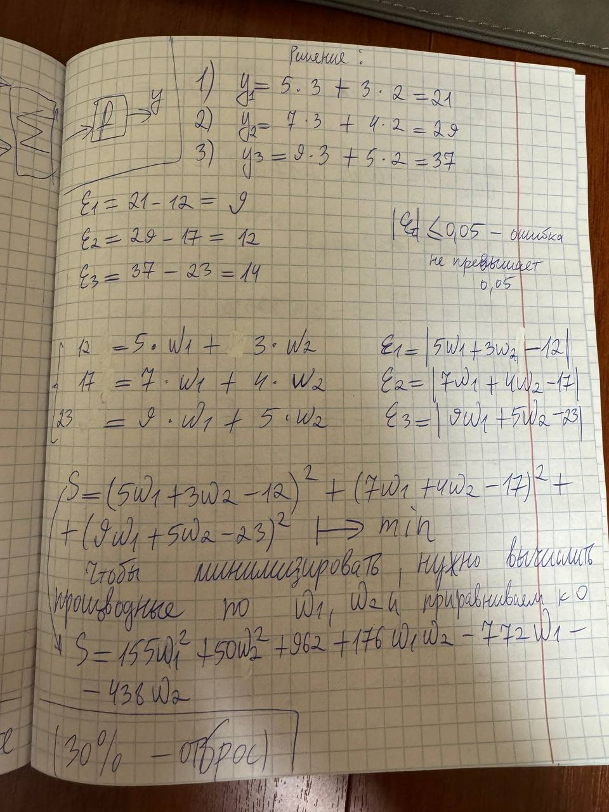
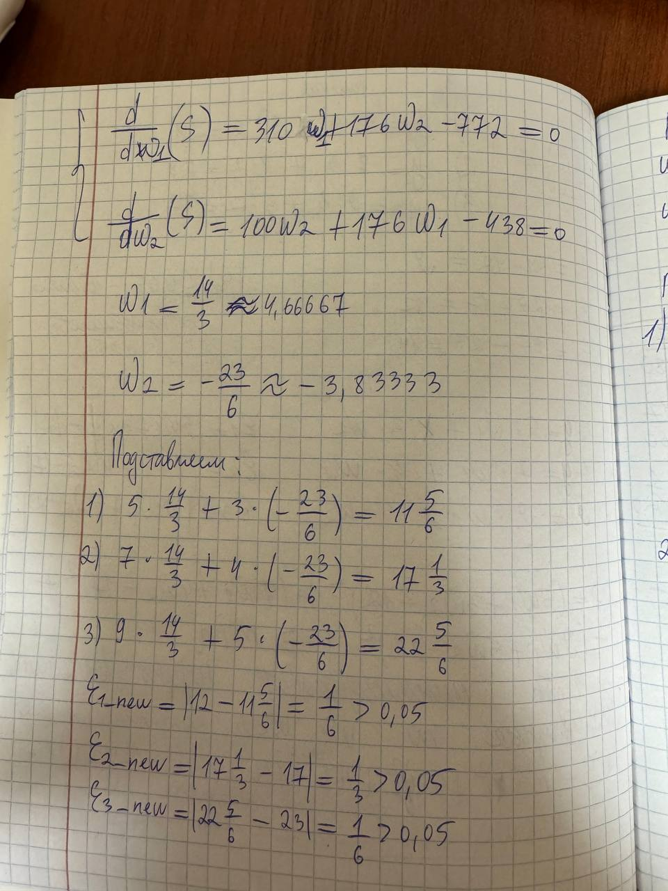
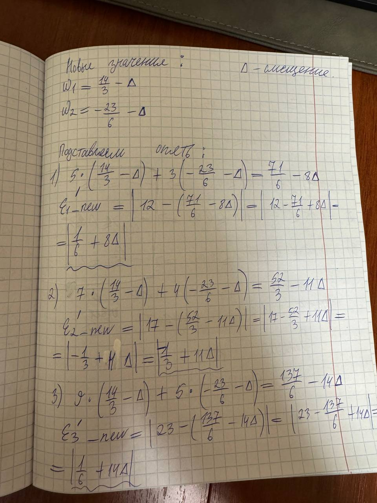
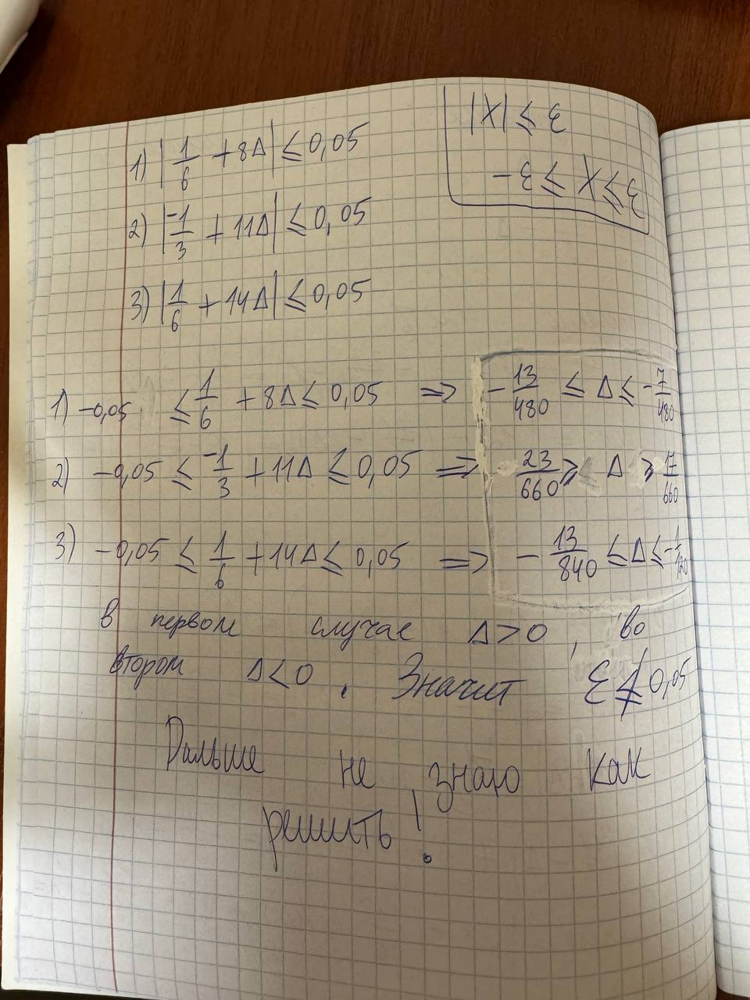

# machine_learning

В решении используется метод наименьших квадратов.

Дальше не получилось определить дельта, потому что эпсилон я выбрал очень маленькое (эпсилон по идее не можеть быть меньше 0,3333....). Либо я ошибаюсь. Без бутылки тут не разобраться короче. 

